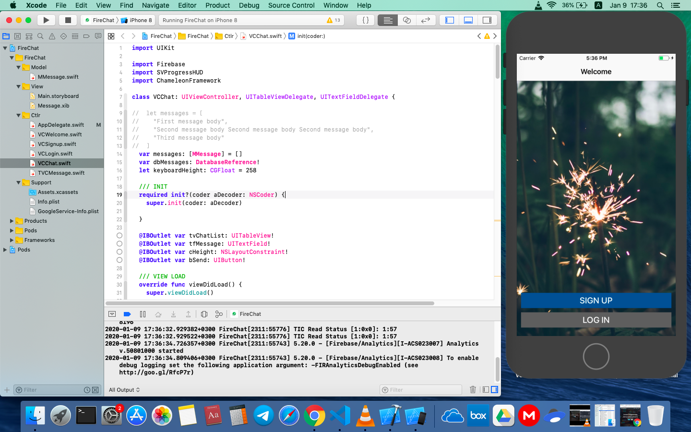

# Swift-Fire-Chat

# App Discription
Chat application for logged users to communicate to each other in common dialog. FireChat is aimed to be simplified version of Telegram.

# Developement Base
Multiview Swift iOS application with storing chat messages in FireBase DB. Implemented Google Auth to register users.

# Installation Guide
Install XCode
Download FireChat
XCode -> File -> Open FireChat.xcworkspace
XCode -> Build and run FireChat on -> Choose plugged device (top-left bar)
|||
Verify developer app certificate on plugged device
Device -> Settings -> General -> Device Management -> Select your Developer App certificate -> Trust

# App Screen
